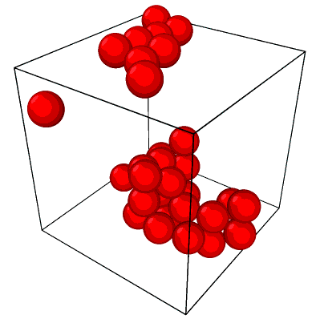

=========
PBCluster
=========

.. image:: https://img.shields.io/pypi/v/pbcluster.svg
        :target: https://pypi.python.org/pypi/pbcluster

.. image:: https://img.shields.io/travis/benlindsay/pbcluster.svg
        :target: https://travis-ci.org/benlindsay/pbcluster

.. image:: https://readthedocs.org/projects/pbcluster/badge/?version=latest
        :target: https://pbcluster.readthedocs.io/en/latest/?badge=latest
        :alt: Documentation Status

.. image:: https://codecov.io/gh/benlindsay/pbcluster/branch/master/graph/badge.svg
        :target: https://codecov.io/gh/benlindsay/pbcluster

* Free software: MIT license
* Documentation: https://pbcluster.readthedocs.io.

This packages makes it easier to analyze particle clusters in boxes with
periodic boundaries.
For example, take a look at this simulation box:

All these particles belong to a single cluster, but because particles jump to
the other side of the box when the cross one of the box faces (like in the
classic `Asteroids game`_),
the cluster appears split into 2 clusters plus a lone particle.
This jumping/wrapping behavior is often called a Periodic Boundary Condition
(PBC).
Typical clustering packages make it difficult or impossible to account for PBCs,
and might classify these particles as belonging to 3 separate clusters.
PBCluster handles periodic boundary conditions, and allows you to calculate
several particle and cluster properties.
Here are some available properties:

Cluster Properties
------------------

- ``n_particles``: number of particles in a cluster
- ``minimum_node_cuts``: the number of particles you'd need to remove to
  break all paths through connected particles from any face to its opposing face.
- ``rg``: the radius of gyration of a cluster
- ``asphericity``: a measure of the elongation of the cluster

Particle Properties
-------------------

- ``coordination_number``: the number of neighboring particles connected to 
  a given particle

Bond Properties
---------------

- ``bonds_df``: a dataframe of particle-particle "bonds" (neighbors within the
  cutoff distance of each other
- ``bond_durations_df``: a dataframe with data about how long particle pairs
  were in contact

You can install this with ``pip install pbcluster``.
For more details check out the `Installation`_ page of the docs.

For an example showing how to use PBCluster, check out the `Example`_ page of
the docs.

Credits
-------

This package was created with Cookiecutter_ and the `audreyr/cookiecutter-pypackage`_ project template.

.. _`Asteroids game`: https://en.wikipedia.org/wiki/Asteroids_(video_game)
.. _`Installation`: https://pbcluster.readthedocs.io/en/latest/installation.html
.. _`Example`: https://pbcluster.readthedocs.io/en/latest/example.html
.. _Cookiecutter: https://github.com/audreyr/cookiecutter
.. _`audreyr/cookiecutter-pypackage`: https://github.com/audreyr/cookiecutter-pypackage
